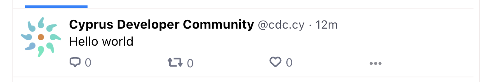

# Bluesky Post Action

<p align="center">
  
</p>

GitHub Action to post to [bsky.app](bsky.app)

## Table of Contents

- [Usage](#usage)
- [Inputs](#inputs)
- [Outputs](#outputs)

## Usage

Can be used directly or in combination with another workflow to prepare the post
content.

```yaml
name: Post on Bluesky Social

on:
  workflow_call:
    inputs:
      post:
        type: string
        required: true
    secrets:
      BSKY_IDENTIFIER:
        required: true
      BSKY_PASSWORD:
        required: true

jobs:
  bsky-post:
    runs-on: ubuntu-latest
    steps:
      - uses: zentered/bluesky-post-action@{LATEST_VERSION}
        with:
          post: ${{ inputs.post }}
          service: ${{ inputs.service }}
        env:
          BSKY_IDENTIFIER: ${{ secrets.BSKY_IDENTIFIER }}
          BSKY_PASSWORD: ${{ secrets.BSKY_PASSWORD }}
```

## Inputs

| Name      | Requirement | Default             | Description                  |
| --------- | ----------- | ------------------- | ---------------------------- |
| `post`    | required    | null                | Richtext Content for Bluesky |
| `service` | optional    | https://bsky.social | at-protocol server           |

## Outputs



### With website embeds


## Testing

You can test this action locally with [act](https://github.com/nektos/act). The
Bluesky identifier and passwords need to be stored in a `.secrets` file, and the
`post` content in a `payload.json` file.

```bash
act -P node:16-buster-slim workflow_dispatch -e payload.json --secret-file .secrets
```

## Contributing

See [CONTRIBUTING](CONTRIBUTING.md).

## License

See [LICENSE](LICENSE).
