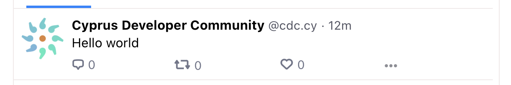

# Bluesky Post Action

<p align="center">
  
</p>

GitHub Action to post to [bsky.app](bsky.app)

## Table of Contents

- [Usage](#usage)
- [Inputs](#inputs)
- [Outputs](#outputs)

## Usage

Can be used directly or in combination with another workflow to prepare the post
content.

```yaml
name: Post on Bluesky Social

on:
  workflow_call:
    inputs:
      post:
        type: string
        required: true
    secrets:
      BSKY_IDENTIFIER:
        required: true
      BSKY_PASSWORD:
        required: true

jobs:
  bsky-post:
    runs-on: ubuntu-latest
    steps:
      - uses: zentered/bluesky-post-action@{LATEST_VERSION}
        id: bluesky-post
        with:
          post: ${{ inputs.post }}
          service: ${{ inputs.service }}
        env:
          BSKY_IDENTIFIER: ${{ secrets.BSKY_IDENTIFIER }}
          BSKY_PASSWORD: ${{ secrets.BSKY_PASSWORD }}
      
      # Example: Use the outputs to update a blog post or database
      - name: Save post information
        run: |
          echo "Posted to Bluesky!"
          echo "URI: ${{ steps.bluesky-post.outputs.uri }}"
          echo "URL: ${{ steps.bluesky-post.outputs.url }}"
          echo "CID: ${{ steps.bluesky-post.outputs.cid }}"
```

## Inputs

| Name      | Requirement | Default             | Description                   |
| --------- | ----------- | ------------------- | ----------------------------- |
| `post`    | required    | null                | Richtext Content for Bluesky  |
| `service` | optional    | https://bsky.social | at-protocol server            |

## Outputs

| Name  | Description                                      | Example                                                                    |
| ----- | ------------------------------------------------ | -------------------------------------------------------------------------- |
| `uri` | The AT Protocol URI of the created post         | `at://did:plc:example123/app.bsky.feed.post/3k2l4j5h6g7f8d9s`              |
| `cid` | The content identifier (CID) of the created post | `bafyreib2rxk3vcfbqsg4qkdl7fvgxe4qn6oysabc123def456ghi789jklmn`           |
| `url` | The human-readable Bluesky URL                   | `https://bsky.app/profile/yourhandle.bsky.social/post/3k2l4j5h6g7f8d9s`    |

### Use Cases for Outputs

- **Prevent duplicate posts**: Store the URI in your blog's frontmatter to avoid reposting
- **Create cross-references**: Link back to the Bluesky post from your website
- **Track engagement**: Use the URL to monitor post performance
- **Content management**: Update databases with post metadata



### With website embeds


## Testing

You can test this action locally with [act](https://github.com/nektos/act).
The Bluesky identifier and passwords need to be stored in a `.secrets` file, and the `post` content in a `payload.json` file.

```bash
act -P node:16-buster-slim workflow_dispatch -e payload.json --secret-file .secrets
```

## Contributing

See [CONTRIBUTING](CONTRIBUTING.md).

## License

See [LICENSE](LICENSE).